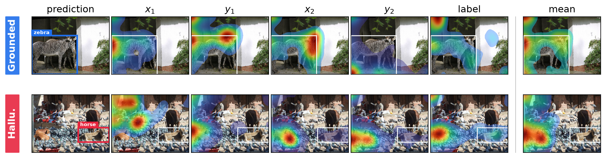

# Propose and Attend: Training-free MLLM Grounding Confidence via Multi-Token Localized Attention

**Does a multimodal LLM actually look where it says it's looking?**

When a vision, video, or audio LLM grounds a prediction (a bounding box, a time span) it also
produces internal attention over the input. MTLA reads that attention and asks one question:
*did the prediction's tokens attend to evidence **inside** the region they claim?* Grounded
predictions do; hallucinations attend elsewhere. The result is a **training-free, post-hoc**
confidence score — no fine-tuning, no extra model, no labels, just the model's own attention from
the forward pass that produced the prediction.

Used as a confidence for self-consistency re-ranking, MTLA lifts an open-source 8B generalist
(Qwen3-VL-8B) from **20.4 → 36.9 AP** on COCO detection — zero-shot, approaching a supervised DETR
detector (42.0 AP).

<p align="center">
  
</p>

## Method

MTLA is a **training-free, post-hoc** confidence score for grounding predictions from multimodal
LLMs. It needs no extra parameters, no fine-tuning, and no auxiliary model: it reads the model's
own attention from the same forward pass that produced the prediction.

**Problem setup.** A grounding MLLM autoregressively emits one or more localized predictions. Each
prediction $p$ has a **proposal region** $R_p$ and a label. Depending on the modality, $R_p$ is a
bounding box $[x_1, y_1, x_2, y_2]$ in an image (coordinates in $[0, 1000]$) or a temporal interval
$[t_{\text{start}}, t_{\text{end}}]$ in video or audio. A prediction is **hallucinated** if its region
matches no ground-truth region under the task's criterion ($\text{IoU} \geq 0.5$ throughout). The goal
is a scalar score $s(p)$, computed from the model's attention, high for grounded predictions and low
for hallucinations.

**Localized Attention (LA).** Let the transformer have $L$ layers and $H$ heads, and let
$X = \{k_1, \dots, k_N\}$ be the input-modality tokens (image patches or video/audio frames). For a
response token at position $q$, the model produces attention weights $a^{(l,h)}_{q \to k}$ over
$k \in X$. The key idea is to restrict the attention sum to the tokens *inside* the proposal region
$M(R_p)$:

$$\mathrm{LA}^{(l,h)}(q) = \sum_{k \in M(R_p)} a^{(l,h)}_{q \to k}$$

A grounded prediction attends strongly to evidence inside its own region; a hallucination relies on
context scattered elsewhere, so its localized attention stays low even when its *global* attention
(the [SVAR](#acknowledgements) baseline, summed over all of $X$) is comparable.

**Multi-token aggregation.** A prediction spans several tokens (the digits of each coordinate plus
the label). Any single token's attention is noisy; averaging across the prediction's tokens $Q_p$
is far more robust — this is **Multi-Token Localized Attention**:

$$\mathrm{MTLA}^{(l,h)}(p) = \frac{1}{|Q_p|} \sum_{q \in Q_p} \mathrm{LA}^{(l,h)}(q)$$

**Layer and head reduction.** Average over heads and over a fixed band of middle layers to get one
scalar:

$$s(p) = \frac{1}{|\mathcal{L}|} \sum_{l \in \mathcal{L}} \frac{1}{H} \sum_{h=1}^{H} \mathrm{MTLA}^{(l,h)}(p)$$

The default band is **layers 8–21** (`mtla.DEFAULT_BAND`), used for every image and video model
tested (Qwen3-VL, InternVL: 36 layers; Gemma-4: 42). MTLA is not sensitive to the exact band. The
whole reduction is `mtla.reduce_band`.

**Self-consistency voting.** Sampling `N` stochastic rollouts per input enlarges the candidate pool
(better recall). We pool predictions across rollouts, merge overlaps with non-maximum suppression,
and score each kept prediction from its cluster's MTLA values (`mtla.nms_fuse`):

- **max** (default): keep the single highest-scoring rollout.
- **sum**: sum the cluster's scores, rewarding regions that recur across rollouts — used for **COCO
  detection**, where each image yields many predictions and sum beats max.

## Results

Headline numbers reproduced by the example configs. MTLA is the inside-region attention score
(ours); **SVAR** (Jiang et al.) is the global-attention baseline we compare against. All use the
default middle-layer band (L8–21); $\text{IoU} \geq 0.5$ throughout.

### Task accuracy after MTLA re-ranking / self-consistency voting

One method, no training. Re-ranking each benchmark's `N=16` stochastic rollouts by MTLA improves
the **standard task metric** — AP for COCO detection and QVHighlights, R@1@0.5 for Charades-STA:

| Benchmark | Model | Metric | MTLA | Supervised reference |
|---|---|---|--:|--:|
| COCO detection | Qwen3-VL-8B | AP | **36.9** | 42.0 *(DETR)* |
| QVHighlights (video) | Qwen3-VL-8B | mAP | **36.6** | 30.7–39.9 *(Moment-DETR / QD-DETR)* |
| Charades-STA (video) | Qwen3-VL-8B | R@1@0.5 | **55.4** | 52.1–57.3 *(Moment-DETR / QD-DETR)* |

Zero-shot and training-free, MTLA approaches the supervised range: on COCO it lifts Qwen3-VL-8B from
20.4 to 36.9 AP (raw → N=16 MTLA voting), and on the video benchmarks it lands between Moment-DETR
and QD-DETR. Every COCO run prompts the model with the full 80-class COCO vocabulary on each image
(open-vocabulary detection).

### Hallucination detection — AUROC (single rollout)

How well the score separates grounded from hallucinated predictions.

| Benchmark | Model | MTLA | SVAR baseline |
|---|---|--:|--:|
| COCO detection | Qwen3-VL-8B | **0.890** | 0.763 |
| COCO detection | InternVL3.5-8B | **0.916** | 0.803 |
| COCO detection | Gemma-4 E4B | **0.753** | 0.671 |
| QVHighlights (video) | Qwen3-VL-8B | **0.800** | 0.415 |
| Charades-STA (video) | Qwen3-VL-8B | **0.684** | 0.512 |

> The COCO and QVHighlights rows are reproducible end-to-end with the example configs below.

## Setup

```bash
git clone https://github.com/TalRemez/MTLA.git
cd MTLA
conda create -n mtla python=3.10 -y
conda activate mtla
pip install uv
uv pip install -r requirements.txt
```

## Full reproduction — the three-stage pipeline

Every benchmark runs through the same three stages; a YAML config picks the model + dataset. No data
or bulk features ship with the repo — you download the datasets and regenerate the features (GPU for
`generate`/`extract`, CPU for `score`).

### 1. Prepare the data

One script per dataset, into the repo-relative `data/` directory the configs point at. Each prints
the `paths:` to copy into your config and downloads everything it needs, **including the video
clips** (large; pass `--skip-videos` to fetch annotations only). Sources, JSON schema, and sizes:
[`docs/DATA.md`](docs/DATA.md).

```bash
python -m scripts.prepare_coco
python -m scripts.prepare_qvhighlights   # ~134GB of video; --skip-videos for annotations only
python -m scripts.prepare_charades       # ~15GB of video;  --skip-videos for annotations only
```

### 2. Run the three stages

Each stage is one config-driven command; they chain by writing files the next stage reads:

```
┌────────────────────────────────────────────────────┐
│  generate.py    vLLM decoding              (GPU)   │
└─────────────────────────┬──────────────────────────┘
                          │  predictions.json   (per rollout seed K)
                          v
┌────────────────────────────────────────────────────┐
│  extract.py     HF eager-attention         (GPU)   │
│  MTLA: attention inside the region R_p             │
└─────────────────────────┬──────────────────────────┘
                          │  [L, H] attention shards   (per seed K)
                          v
┌────────────────────────────────────────────────────┐
│  evaluate.py    band + voting + metrics    (CPU)   │
└────────────────────────────────────────────────────┘
```

Launch-time flags (not in the config): `--n` sets the rollout count and is on **`generate` only**
(default 1); `extract` and `score` need no `--n` — they discover the rollout seeds from what the
previous stage wrote on disk and print how many they found. `--gpus` (default: all visible GPUs) and
`--limit N` (run only the first N items — e.g. `--limit 100` for a quick smoke test; default: the
full set) apply to the GPU stages. Every benchmark uses the **same three commands** — only the
`--config` (and, for voting, `generate`'s `--n` / `score`'s `--agg`) changes. The runnable examples
below cover COCO detection and the two video benchmarks.

### COCO detection — quick smoke test (2 rollouts, 50 images)

A fast end-to-end check of all three stages on a small slice — `generate` makes `--n 2` rollouts
over the first `--limit 50` images; `extract`/`score` then pick up those 2 rollouts automatically
and process exactly what `generate` wrote (they take no `--limit`). Drop the flags to run the full
benchmark.

```bash
python -m generate --config configs/coco_qwen3vl.yaml --n 2 --limit 50
python -m extract --config configs/coco_qwen3vl.yaml
python -m evaluate --config configs/coco_qwen3vl.yaml
```

The full single-rollout run (`python -m generate --config configs/coco_qwen3vl.yaml`, then
`extract` / `evaluate` with no flags) reproduces the hallucination-detection AUROC (0.890 for
Qwen3-VL-8B; 0.916 with `--config configs/coco_internvl.yaml`).

### COCO detection — N=16 self-consistency voting

The headline detection result: **mAP 36.9** with Qwen3-VL-8B (COCO uses sum-of-cluster fusion,
`--agg sum`).

```bash
python -m generate --config configs/coco_qwen3vl.yaml --n 16
python -m extract --config configs/coco_qwen3vl.yaml
python -m evaluate --config configs/coco_qwen3vl.yaml --agg sum
```

### Video (QVHighlights & Charades-STA) — N=16 self-consistency voting

Same three commands; video uses the default `max` fusion (no `--agg`). **QVHighlights**: mAP 36.6,
R@1@0.5 55.1. **Charades-STA**: R@1@0.5 55.4, R@1@0.3 76.3.

```bash
python -m generate --config configs/qvhighlights_qwen3vl.yaml --n 16
python -m extract --config configs/qvhighlights_qwen3vl.yaml
python -m evaluate --config configs/qvhighlights_qwen3vl.yaml
```

```bash
python -m generate --config configs/charades_qwen3vl.yaml --n 16
python -m extract --config configs/charades_qwen3vl.yaml
python -m evaluate --config configs/charades_qwen3vl.yaml
```

Add `--gpus 0 1 2 3 ...` to any `generate`/`extract` command to pick GPUs (default: all visible).
COCO runs on **either model** — same `CocoDataset`, just a different `model:` — because models and
datasets are independent adapters.

## Visualize the per-token attention

`scripts/figure_pertoken.py` shows *why* MTLA works: for a chosen prediction it runs one HF-eager
forward and renders where **each** of the prediction's response tokens attends over the image. Each
row is one prediction; the columns are:

- **prediction** — the image with the predicted box drawn on it;
- **$x_1, y_1, x_2, y_2$** — the attention of each of the four bounding-box coordinate tokens (the
  digits Qwen emits for that coordinate), upsampled and overlaid on the image;
- **label** — the attention of the class-label token;
- **mean** (right of the dashed rule) — the per-token average, i.e. the quantity MTLA scores.

Grounded predictions concentrate this attention **inside** the proposed box; hallucinations scatter
it across the scene. The figure is Qwen3-VL–specific (it reads Qwen's `bbox_2d` output and hooks the
Qwen3-VL attention module), so it only runs on the `coco_qwen3vl` config.

**Full reproduction.**

```bash
# 0. prepare COCO once (images + annotations); see "Prepare the data" above.
python -m scripts.prepare_coco

# 1. generate a few Qwen3-VL COCO predictions for the figure to read. The figure renders one
#    prediction per target, so a handful of images is plenty; it reads rollout0/predictions.json
#    under runs/coco/qwen3vl_image/predictions/.
python -m generate --config configs/coco_qwen3vl.yaml --limit 10

# 2. render. --targets is a space-separated list of <image_id>:<pred_idx>:<grounded|hallu>:
#      image_id  = a COCO image id present in step 1's predictions,
#      pred_idx  = which parsed box in that image's response (0 = first),
#      grounded|hallu = only the row's colour/label (blue vs red); it does not change the attention.
python -m scripts.figure_pertoken --config configs/coco_qwen3vl.yaml \
    --targets 397133:0:grounded --out figure_pertoken.png
```

To pick valid `--targets`, list the image ids that produced boxes in step 1:

```bash
python - <<'PY'
import json
from mtla.registry import resolve
model, _ = resolve("qwen3vl_image", "coco")
preds = json.load(open("runs/coco/qwen3vl_image/predictions/rollout0/predictions.json"))
for r in preds[:10]:
    n = len(model.parse_response(r["response"]))
    print(f"image_id={r['id']}  n_predictions={n}")   # use any id with n_predictions >= 1
PY
```

With no `--targets`, the script uses the paper's Fig. 3 image ids (`64499`, `60823`); those only
render if those images are in your predictions (run without `--limit`, or add them to the target
list). Other flags: `--out` (path; a `.png` is always also written), `--gpu` (device index), and
`--norm per-column|per-map` (shared colour scale per token across rows, or each panel by its own
peak).

<p align="center">
  
</p>

## Extending: add a model or a task

Models and datasets are **independent registries**; any valid `(model × dataset)` pair runs from a
config. Adapters **self-register** with a decorator and are auto-discovered, so adding one is just a
new file — no central registry to edit.

```python
from mtla import resolve, available_models, available_datasets
available_models()      # ['internvl_image', 'qwen3vl_image', 'qwen3vl_video']
available_datasets()    # ['charades', 'coco', 'qvhighlights']
model, dataset = resolve("qwen3vl_image", "coco")   # unknown key -> error listing what's available
```

**Decoupled stages.** `generate` (vLLM) writes `predictions.json`; `extract` (always HF-eager)
re-runs the model to capture attention. vLLM can't expose attention, so this split lets generation
stay fast while extraction stays faithful. Full walkthrough with the exact adapter contract:
[`docs/EXTENDING.md`](docs/EXTENDING.md).

## Repository layout

Run everything from the repo root with `python -m` (no install; `mtla` is imported in place).

```
generate.py            stage 1 CLI  (python -m generate)  — vLLM decoding
extract.py             stage 2 CLI  (python -m extract)   — HF eager-attention capture
evaluate.py            stage 3 CLI  (python -m evaluate)  — load shards + AUROC + voting + metrics (CPU)
gen_strategies.py      vLLM execution strategies for generate (pooled / sharded)

mtla/                  core library (imported in place, no pip install)
  mtla_attn.py         the MTLA computation: localized attn (eqs. 2-3) + reduce_band (eq. 4) +
                       eager-attn capture + per-item driver
  voting.py            self-consistency voting (vote / nms_fuse; max / sum / support / mean)
  metrics.py           pure computers: AUROC, COCO mAP, moment-retrieval / R@1
  utils.py             iou/tiou (+ overlap_fn), token-span helpers, attention heatmap upsampling
  registry.py          @register_model / @register_dataset + resolve(model, dataset)
  config.py            YAML -> RunConfig
  models/              model adapters: internvl.py, qwen3vl.py  (+ base.py)
  data/                dataset adapters: coco.py, qvhighlights.py, charades.py  (+ base.py)

configs/               one YAML per (model x dataset): coco_internvl, coco_qwen3vl,
                       qvhighlights_qwen3vl, charades_qwen3vl
scripts/
  prepare_*.py         one dataset-prep script per benchmark  (python -m scripts.prepare_coco, ...)
  figure_pertoken.py   per-token attention visualization      (python -m scripts.figure_pertoken)
docs/                  DATA.md, EXTENDING.md
third_party/           vendored Moment-DETR evaluation (MIT)
```

## Citation

A paper describing MTLA is in preparation; citation and link will be added here on release. See
[`CITATION.cff`](CITATION.cff).

## Acknowledgements

Builds on **SVAR** (Jiang et al., *Devils in Middle Layers of Large Vision-Language Models*) as the
global-attention baseline, and uses **Qwen3-VL** and **InternVL** as the grounding models. Video
evaluation uses the **Moment-DETR** standalone evaluator (MIT, vendored under `third_party/`).

## License

See [`LICENSE`](LICENSE).
