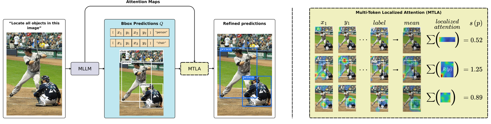

# MTLA: Multi-Token Localized Attention

**Does a multimodal LLM actually look where it says it's looking?**

When a vision/video/audio LLM grounds a prediction — draws a bounding box, names a time span —
it also produces internal attention over the input. MTLA reads that attention and asks a
simple question: *did the prediction's tokens attend to evidence **inside** the region they
claim?* Grounded predictions do; hallucinations attend elsewhere. The result is a
**training-free, post-hoc** confidence score that needs no fine-tuning, no extra model, and
no labels — just one forward pass of the model you already have.

<p align="center">
  
</p>
<p align="center"><em>An MLLM emits box+label predictions; MTLA reads the decoder's attention from
each prediction's tokens, restricts it to the patches inside the proposed region, and scores the
prediction by how much attention falls inside — high when grounded, low when hallucinated.</em></p>

## Why it works

```
SVAR baseline:  sum attention over ALL input tokens          (global)
MTLA (ours):    sum attention over tokens INSIDE the region  (localized)  ... averaged over
                the prediction's tokens, over heads, over a band of middle layers.
```

A hallucination can still attend to *something*; what it cannot do is attend to evidence
that isn't there, inside the box it invented. Restricting the attention sum to the proposal
region is what separates the two. See [`docs/METHOD.md`](docs/METHOD.md) for the full method.

## Results at a glance (hallucination-detection AUROC)

| Benchmark | Model | MTLA | SVAR baseline |
|---|---|--:|--:|
| COCO detection | Qwen3-VL-8B | **0.90** | 0.76 |
| QVHighlights (video) | Qwen3-VL-8B | **0.80** | 0.42 |
| Charades-STA (video) | Qwen3-VL-8B | **0.68** | 0.51 |
| AudioSet-Strong (audio) | Audio Flamingo 3 | **0.81** | 0.61 |

The same idea also improves task metrics via self-consistency voting (COCO **41.9** mAP at
N=16; QVHighlights **36.6** mAP). One method, four modalities, no training. Full table:
[`docs/RESULTS.md`](docs/RESULTS.md).

## Quickstart (60 seconds, CPU, no GPU / no downloads)

```bash
pip install -e ".[demo,coco]"
python examples/demo.py
```

This loads a small bundled fixture of pre-extracted attention (InternVL3.5-8B on COCO) and:

1. scores ~800 predictions, printing MTLA vs SVAR AUROC (MTLA ≈ 0.87, SVAR ≈ 0.79);
2. renders attention heatmaps for one image into `examples/output/`, showing the model
   looking inside a grounded box but scattering on a hallucinated one.

## Use it on your own predictions

**What MTLA consumes.** For one prediction, the only input is a `[L, H]` attention array —
the attention its tokens pay to the input, summed over the modality tokens **inside** its
proposed region, per transformer layer `L` and head `H`. `reduce_band` collapses that to one
scalar (mean over heads, sum over the layer band). You produce these arrays with the extract
stage (`run.py --stage extract`); see [`mtla/extract.py`](mtla/extract.py) for the hook.

**Score a single prediction.** `>` means more grounded.

```python
import numpy as np
from mtla import reduce_band

# [L, H] attention: layers x heads. Here L=36, H=32 (e.g. InternVL3.5-8B).
inside = my_record["image_inside_sum"]   # attention restricted to patches INSIDE the box -> MTLA
glob   = my_record["image_sum"]          # attention over ALL image tokens         -> SVAR baseline

mtla = reduce_band(inside)               # default band L8-21; pass band=None for all layers
svar = reduce_band(glob)
print(f"MTLA={mtla:.3f}  SVAR={svar:.3f}")
```

**Score a list and flag hallucinations.** `reduce_band` is vectorized over a leading axis,
and `auroc` measures how well the score separates grounded from hallucinated predictions.

```python
from mtla import reduce_band, auroc

inside = np.stack([r["image_inside_sum"] for r in records])  # [N, L, H]
scores = reduce_band(inside)                                  # [N]  (one MTLA score each)

labels = [r["is_hallucinated"] for r in records]             # your IoU>=0.5 ground-truth flags
print(f"AUROC = {auroc(scores, labels):.3f}")                # how well MTLA flags hallucinations
```

**Try it now** on the bundled fixture — no GPU, no data download:

```python
import torch
from mtla import reduce_band, auroc

data = torch.load("fixtures/coco_demo.pt", weights_only=False)["scoring"]  # ~800 InternVL preds
scores = [reduce_band(r["attn_coord_mean"]["image_inside_sum"]) for r in data]
labels = [r["is_hallucinated"] for r in data]
print(f"MTLA AUROC = {auroc(scores, labels):.3f}")           # ~0.87
```

Have raw boxes but no attention yet? `mtla.mask` turns a region into the inside-token indices
the extractor needs: `bbox_to_patch_indices` / `bbox_to_internvl_token_indices` (images),
`span_to_token_indices` (video/audio).

The package is small and modular:

| Module | What it does |
|---|---|
| `mtla.score` | `reduce_band`, `mtla_score`, `svar_score` — the layer-band + head reduction |
| `mtla.mask` | map a box / time-span to the modality-token indices inside it (`M(R_p)`) |
| `mtla.extract` | the eager-attention monkeypatch that captures per-token attention |
| `mtla.voting` | self-consistency NMS fusion across rollouts (`max` / `sum` / ...) |
| `mtla.eval` | hallucination AUROC and COCO mAP |
| `mtla.viz` | attention heatmap overlays |

## Full reproduction — one config-driven pipeline

Every benchmark runs through the same three stages; a YAML config picks the model + dataset.
No bulk features are shipped; you regenerate them (GPU needed for `generate`/`extract`,
`score` is CPU-only).

```bash
python run.py --config configs/coco_internvl.yaml      --stage generate   # GPU
python run.py --config configs/coco_internvl.yaml      --stage extract    # GPU
python run.py --config configs/coco_internvl.yaml      --stage score      # CPU
```

Swap the config to run another benchmark — same commands:

| Config | Benchmark / model | Reproduces |
|---|---|---|
| `configs/coco_internvl.yaml` | COCO detection / InternVL3.5-8B | AUROC 0.873; mAP 41.9 @ N=16 |
| `configs/qvhighlights_qwen3vl.yaml` | QVHighlights / Qwen3-VL-8B | mAP 36.6, R@1@0.5 55.1 |
| `configs/charades_qwen3vl.yaml` | Charades-STA / Qwen3-VL-8B | R@1@0.5 55.4, R@1@0.3 76.3 |

CLI flags override the config for quick sweeps: `--n 16 --agg sum --slot first_digit`.
Datasets and paths: [`docs/DATA.md`](docs/DATA.md).

## Extending: add a new model or task

The pipeline is two registries; adding a benchmark is writing one small adapter, not editing
`run.py`.

**A new model family** (`mtla/models/<name>.py`): subclass `ModelAdapter`, set `model_id` and
`attn_module_path` (the transformers module whose `eager_attention_forward` to hook), and
implement `parse(response)` (text -> `[Prediction(region, label)]`) and `region_mask(region,
meta)` (delegate to `mtla.mask` — image patches / tiling / temporal span). Register it in
`mtla/models/__init__.py`.

**A new task / dataset** (`mtla/data/<name>.py`): subclass `DatasetAdapter` and implement
`load_items`, `prompt`, `ground_truth`, `score` (reuse `mtla.reduce_band` + `mtla.nms_fuse` +
`mtla.eval`), and the `generate`/`extract` GPU stages (point them at a script in
`mtla/stages/`). Register it in `mtla/data/__init__.py`, then add a `configs/<name>.yaml`.

That's it — `python run.py --config configs/<name>.yaml --stage score` now works. See
`mtla/data/charades.py` for the smallest complete example.

## Repository layout

```
mtla/                  core package
  score / mask / voting / eval / extract / viz   parameter-free MTLA building blocks
  config.py            YAML -> RunConfig
  models/              model adapters: internvl, qwen3vl  (parse, region mask, attn hook)
  data/                dataset adapters: coco, qvhighlights, charades  (load, prompt, score)
  stages/              validated GPU generate/extract scripts the adapters drive
run.py                 unified CLI: --config <yaml> --stage {generate,extract,score}
configs/               one YAML per model x dataset
examples/demo.py       CPU demo on the bundled fixture (no GPU, no download)
fixtures/              small committed demo fixture
docs/                  METHOD.md, DATA.md, RESULTS.md
third_party/           vendored Moment-DETR evaluation (MIT)
```

## Citation

A paper describing MTLA is in preparation; citation and link will be added here on release.
See [`CITATION.cff`](CITATION.cff).

## Acknowledgements

Builds on **SVAR** (Jiang et al., *Devils in Middle Layers ...*) as the global-attention
baseline, and uses **Qwen3-VL**, **InternVL**, and **Audio Flamingo 3** as the grounding
models. Video evaluation uses the **Moment-DETR** standalone evaluator (MIT, vendored under
`third_party/`).
